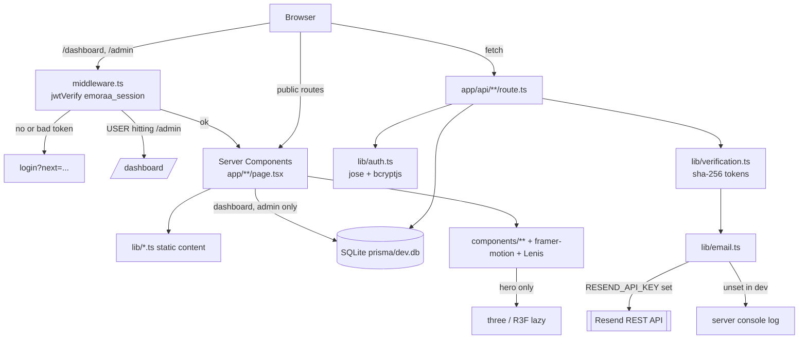
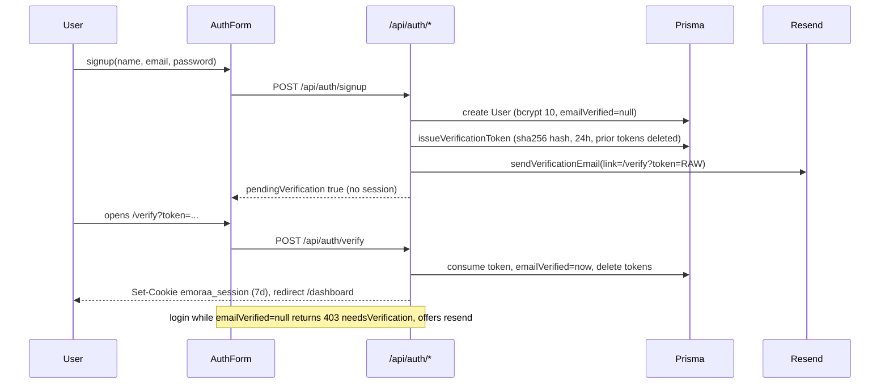
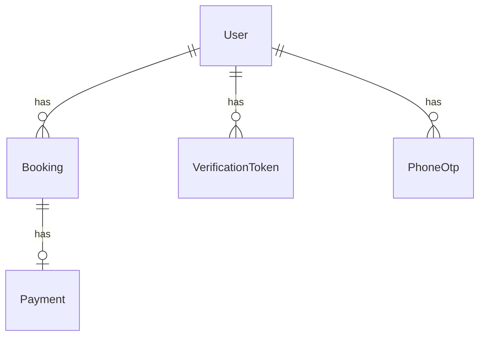

# CODEBASE_CONTEXT.md

> Canonical memory + map of this repository. **Read this first.** Only open source
> files listed under *Change Impact Map* / *File Importance Ranking* for the specific
> change you're making. Do not rescan the repo unless architecture changed.
> Last full scan: 2026-08-27 · branch `Tarush` · 1 commit (`1b29a2d Initial commit`).
> Renamed 2026-08-30: **mann Matters → Emoraa** (domain `emoraa.in`, cookie `emoraa_session`,
> booking refs `EM-`). Bookings created before the rename keep their `MM-` refs.
> Last updated: 2026-09-04 — booking feature boundary introduced; client journey build-out (payments, reschedule, profile,
> real availability, state coverage, security hardening). Sections revised: Tech Stack,
> Project Structure, Architecture, Core Modules, API Reference, Database, Business Rules,
> Testing, Known Technical Debt, Change Impact Map, File Importance Ranking, Glossary.

---

## Session Bootstrap

Everything needed to start work with no extra reading:

- **What**: `Emoraa` — Next.js 14 App Router marketing site + therapy-booking
  product for Indian youth/students/professionals. Serene, editorial, "boutique
  commission not template" visual bar.
- **Root**: `c:\Users\dell\Desktop\Emoraa` · Windows · PowerShell primary.
- **Run**: `npm install` → `npm run dev` (:3000). Build `npm run build`; serve `npm start`.
  No lint/test scripts exist. ESLint is **disabled at build** (`next.config.mjs`).
- **DB**: SQLite via Prisma 6 at `prisma/dev.db`. `npx prisma db push` to sync schema,
  `npx prisma db seed` (→ `prisma/seed.mjs`) to create the admin. **No migrations dir** — schema is push-only.
  Tables include `User`, `VerificationToken`, `PhoneOtp`, `Booking`, `Payment`.
- **Auth**: email + password or verified phone + one-time code. Both issue a JWT (`jose`, HS256)
  in the httpOnly cookie `emoraa_session`, 7-day TTL. `middleware.ts`
  guards `/dashboard/*` and `/admin/*`. Roles `USER` | `ADMIN` (string, not enum — SQLite).
- **Import alias**: `@/*` → repo root. Strict TS, `noEmit`.
- **Data model**: content (experts, services, posts, tools, testimonials, faqs, helplines)
  is **static typed TS in `lib/`**, not a CMS/DB. Only users/bookings/payments/tokens are persisted.
- **Booking invariant**: a slot is held by the UNIQUE `Booking.slotKey` (`expertId|date|time`);
  releasing it is `slotKey = null`. Availability is *derived* from that column. Never add a
  second source of truth for availability — verified: 6 parallel holds → exactly 1 winner.
- **Booking lifecycle**: `PENDING_PAYMENT` (slot held ~15 min) → `CONFIRMED` on payment
  → `CANCELLED`; or → `EXPIRED` if the hold lapses unpaid. Holds are swept lazily by
  `releaseExpiredHolds()` on every availability read and competing write — there is no cron.
- **All policy lives in `lib/features/booking/policy.ts`** (IST math, 24-hour change window, refunds,
  hold TTL, max reschedules). Client and server both import it, so copy and logic agree.
- **Styling**: Tailwind + brand tokens in `tailwind.config.ts`; shared component classes
  (`.wrap`, `.page-top`, `.eyebrow`, `.h-display`, `.prose-mm`, `.link-draw`, `.card-lift`)
  in `app/globals.css`. Use these — do not re-invent spacing/typography.
- **Motion**: framer-motion everywhere + Lenis smooth scroll. Every animation must honor
  `prefers-reduced-motion` (already wired via `MotionConfig reducedMotion="user"`).
- **Money**: INR, `formatINR()`. **Dates**: `YYYY-MM-DD` strings, times `HH:mm`, always IST —
  use `todayIST()` / `sessionStart()` from booking-policy, **not** `utils.todayISO()` (server-local).
- **Payments are simulated** (`lib/payments.ts`) with deterministic triggers, swappable for a
  real gateway by keeping `charge()`'s signature. Card PAN/CVV are never stored or logged —
  only brand + last4.
- **Safety rule (product-critical)**: this is *not* a crisis service. Crisis routing to
  Tele-MANAS `14416` / emergency `112` must remain reachable from every page
  (`SafetyNotice`, `ChatAssistant`, `/crisis`). Never remove or bury it.
- **Nothing is deployed/CI'd**: no Dockerfile, no GH Actions, no vercel.json. Vercel-ready by convention.

---

## Repository Overview

- **Purpose**: Marketing site + self-serve booking for online therapy, plus a suite of
  free self-help tools and an editorial blog.
- **Business domain**: Mental health / teletherapy, India. B2C (individual, couples,
  student pricing) + B2B (`/for-organisations`: colleges, corporates).
- **Primary user flows**
  1. Land → browse/tools/blog → `/book` → **auth gate first** → concern → expert →
     live slot → review → hold → pay → confirmation.
  2. Signup → email verification link → auto-login → `/dashboard` (view, pay, move, cancel)
     → `/dashboard/profile` (details, password, "what we hold about you").
  3. Admin login → `/admin` (client roster, booking + payment stats, search).
  4. Anonymous tool use (`/breathe`, `/check-in`, `/match`, `/tools/*`) — no auth, no server.
  5. Crisis path → `SafetyNotice`/`ChatAssistant`/`/crisis?sos=true` → helplines.
- **Key architectural decisions**
  - App Router; **server components by default**, `"use client"` only for interactive leaves (~45 files).
  - Content-as-code in `lib/` (single source per domain object; UI never re-declares data).
  - Auth is DIY (jose + bcryptjs), no NextAuth. Session claims carry `role` so middleware
    can gate without a DB hit.
  - Tools are 100% client-side and privacy-preserving (journal → `localStorage` only).
  - Availability is **real**, derived from the UNIQUE `Booking.slotKey`; the constraint —
    not a read-then-write check — is what prevents double booking.
  - The booking flow gates on auth **before** asking about a concern: health information is
    never entered into a form that could bounce to a login, and never put in browser storage.
  - Payment is a swappable simulator (`lib/payments.ts`) with deterministic failure triggers,
    so every failure screen is reachable on demand rather than by waiting for a real decline.
  - Route handlers return a stable `{ error, code, fields? }` envelope and `no-store`;
    ownership failures are reported as 404, never 403, so ids can't be probed.
  - `dynamic = "force-dynamic"` on `/dashboard`, `/dashboard/profile`, `/admin`, `/book`,
    and all `/api/*`; everything else static/SSG.

---

## Tech Stack

| Layer | Choice |
|---|---|
| Language | TypeScript 5.6 (strict), some `.mjs` (seed, next config) |
| Framework | Next.js 14.2 App Router, React 18.3 |
| Styling | Tailwind 3.4 + custom tokens, PostCSS, autoprefixer |
| Motion | framer-motion 11, lenis 1.1 |
| 3D | three 0.169, @react-three/fiber 8, @react-three/drei 9 (hero only, lazy) |
| DB | SQLite + Prisma 6 (`@prisma/client`) |
| Auth | jose 6 (JWT HS256), bcryptjs 3 (cost 10) |
| Avatars | @dicebear/core + collection 9 |
| Email | nodemailer (Gmail SMTP) → Resend REST → console fallback, in that order |
| Fonts | next/font Google: Fraunces (display), Plus Jakarta Sans (sans), Tiro Devanagari Hindi (देवनागरी) |
| Images | next/image; remote allowlist: `images.unsplash.com` only |
| Payments | simulated in-house (`lib/payments.ts`); no gateway SDK |
| Security | per-route rate limiting (in-memory), same-origin checks, security headers in `next.config.mjs` |
| Build | next build; **no test framework or CI** (see Testing for what was verified and how) |

---

## Project Structure

### `app/` — routes (App Router)
- `layout.tsx` **critical**: fonts, metadata/OG defaults, global chrome (`Providers` → `Navbar`,
  `main`, `Footer`, `WhatsAppButton`, `ChatAssistant`, `SafetyNotice`).
- `template.tsx`: per-route fade+rise transition.
- `globals.css` **critical**: base + `@layer components` shared classes + reduced-motion guards.
- `page.tsx`: home = ordered composition of 12 `components/sections/*`.
- Public pages: `services/`, `for-organisations/`, `about/`, `contact/`, `made-in-india/`,
  `crisis/`, `blog/` + `blog/[slug]/` (SSG), `not-found.tsx`.
- Tool pages: `breathe/`, `check-in/`, `match/`, `tools/` index + `tools/{grounding,relax,sounds,affirmations,sleep,journal,bmi}`.
- Auth pages: `login/`, `signup/` (both render `AuthForm`), `verify/` (renders `VerifyClient`).
- Gated pages: `dashboard/`, `admin/` — server components, direct Prisma reads, `force-dynamic`.
- SEO: `sitemap.ts` (manual static route list + posts), `robots.ts`, `icon.svg`.
- `api/` — see *API Reference*.

### `components/`
- `layout/TalkToManuButton.tsx`: the WhatsApp CTA, framed as a person not a channel —
  WhatsApp glyph in its own #25D366 (recolouring it kills recognition) + a live presence dot
  + a `free · any hour` note. Used in the hero; `label`/`note` props make it reusable.
  **Not** used on `/crisis`, deliberately — see Business Rules.
- `layout/`: `Navbar` (350 L; polls `/api/auth/me` on every pathname change), `Footer`
  (newsletter = stub), `Providers` (Lenis + MotionConfig), `WhatsAppButton`, `SafetyNotice`, `BackButton`.
- `sections/`: home/page sections. **Orphans (unused): `ServicesPreview`, `WhatsAppCompanion`
  (which is the only consumer of `WhatsAppChat`).**
- `booking/`: `BookingFlow` (5-step machine + auth gate + confirmation), `SlotPicker`
  (live availability, loading/empty/error states), `PaymentPanel` (method choice, validation,
  failure + retry, hold countdown), `BookingCard` (every booking state), `RescheduleDialog`,
  `CancelBookingButton` (refund shown before the decision).
- `profile/`: `ProfileForm` (name, phone, language, therapist note), `PasswordForm`.
- `auth/`: `AuthForm` (login+signup in one, `mode` prop), `VerifyClient`, `LogoutButton`.
- `blog/`: `BlogIndex`, `PostCover`, `ArticleContents`, `ReadingProgress`, `ShareRow`.
- `tools/`: one component per tool + `ChatAssistant` (rule-based, global, no backend)
  + `TherapistMatcher`.
- `TryManu/`: `TryManuDemo` (WhatsApp-bot demo; **fetches `/api/manu-demo`, which does not exist**
  — falls back to a canned reply), `TypingDots`, `scenarios.ts`.
  **Trilingual**: `scenarios.ts` holds every thread in `en` / `hi` / `hinglish` (`Lang`), plus a
  `UI` record for the card's chrome. Default `hinglish`; choice persisted to `localStorage`
  under `emoraa.manu.lang`. Switching **converts the visible bubbles in place** (mapped by
  `script: {scenario, index}`) rather than replaying — a visitor's own typed text is never
  rewritten. `playThread` re-reads `langRef` each step, so a switch mid-animation carries.
  **Invariant**: a scenario's threads must be parallel across languages (same length, same
  roles by index); `assertParallelThreads()` logs drift in dev, stripped in prod.
- `organisations/`: `SegmentGrid` (the six institution cards, each with a photograph and its
  own "Build a pack for us" trigger), `PackBuilder` (the enquiry composer — focus trap, Escape
  to close, focus restored to the opener), `PackCta` (page-level trigger). These replaced a
  `mailto:` template that silently did nothing on any device without a mail client.
- `visuals/`: the canvas family. `useCanvasScene.ts` holds the shared machinery
  (hi-dpi sizing, ResizeObserver, rAF loop, pointer, reduced-motion) plus `PALETTE`/`rgba`/`mix`,
  so a new scene is only its drawing code. Scenes: `NodeBuilding` (`/for-organisations` — a stack of
  **cantilevered volumes** in axonometric projection (`project()` maps x/height/depth to canvas,
  so boxes have real tops and sides). One volume per entry in `pillars`; corners are nodes, edges
  beams, front faces carry window-node grids. Colour grades amber-gold at street level → lime →
  deep forest at the roof. Click a volume: its windows light in sequence, then the light carries
  up and down the stack one storey at a time), `Weave` (parity-grid handloom, `/made-in-india` — click throws a gold
  weft), `InkLines` (`/blog` — the page writing itself: a
  nib crosses left to right and word-clusters of nodes land behind it, one line per entry in
  `lib/posts.ts`, **length = read time**, **colour = category**; click a line and it rewrites
  from the start with an ink-drop ripple. The blog page had no hero section, so one was added
  following the placement contract below), `ChaiSteam` (`/about` — a cutting-chai glass in
  nodes (elliptical rim and base, tea visible inside) with coiling steam **wisps**: each is a
  continuous strand whose sway grows with height, and whose brightness travels up it so it
  reads as rising. An earlier particle-scatter version looked like specks, not steam.
  From that page's own "as ordinary as asking for chai"; click pours another), `IndiaOutline` (`/made-in-india` — an outline map of India drawn as a
  **continuous line** that traces itself around the country, colour shifting through the
  palette as it travels, nodes set along it. Click to redraw.
  **`BORDER` is real survey data**, not hand-authored: DataMeet's `india-composite` GeoJSON
  (official outline, full claimed J&K extent), 242k points decimated then Douglas-Peucker'd
  to 400. Three earlier attempts at authoring the coastline from memory all failed — do not
  hand-edit the coordinates, re-derive from the source. Also: rendering the border as loose
  dots does not read as a country; it has to be a line), `Ripples` (`/contact` — small drops opening into wide rings,
  for "No question is too small"; sits **full-bleed behind both columns** because the form
  occupies the right side, and drops arrive unprompted so the surface is never dead),
  `WayThrough` (decaying-noise lanes, `/services` — one lane per entry in
  `lib/services.ts`, agitated and colourless on the left, settling into **its own colour** on
  the right, per the page's own headline; **colour = which format** (rose/indigo reuse the
  brain's limbic/frontal hues so the palettes agree across pages), **strand count = people in
  the room**, **lane length = session duration**. Click fires a four-stage sequence: burst ring
  at the cursor → lit front travelling the lane and calming it → arrival flare → ease back).
  Each uses a *different mechanic* from the brain on purpose, not a different silhouette.
  **Reduced motion must freeze *position*, not just progress** — a scene that stops advancing
  its own clock but still reads live `t` for sway, or derives age from `performance.now()`, keeps
  animating. Both slipped through once; the check is two canvas screenshots 1.3s apart under
  `reducedMotion: "reduce"` being byte-identical.
  **Scene state must live in a `useRef`**, never in component-body locals — a re-render resets
  them and clicks fail a bounds check silently.
  **Placement contract** (all three heroes, copied from the home hero): canvas in a
  `pointer-events-none` wrapper with a `pointer-events-auto` inner; the hero's content column
  gets `pointer-events-none` with `pointer-events-auto` back on its control row; and every
  decorative `absolute inset-0` wash in that section needs `pointer-events-none` or it silently
  eats every click meant for the canvas.
- `three/NeuralBrain.tsx`: hero canvas (2D canvas, not three.js despite the folder).
  **Eight brain regions, each with a feeling and its own colour** (`REGIONS[].rgb`).
  Colour is *earned by interaction*: at rest nodes are tinted only ~20% toward their region
  (stays serene behind the headline); hover blooms one region; **click sends a BFS wave whose
  pulses take the colour of the region they arrive in**, so a thought is seen crossing from
  focus → feeling → memory → calm. Also: comet-trailed pulses, gradient synapses between
  regions, cursor magnetism, region-coloured rings.
  **A11y**: the canvas is `aria-hidden`, so 8 `pointer-events-none` buttons overlay it —
  keyboard/screen-reader only (tab a region, Enter fires it); the mouse uses the canvas.
  **Reduced motion** stops movement but keeps colour feedback (click flashes the region
  instead of animating a wave) — the loop always runs.
- `ui/`: `Button`, `Reveal` (scroll reveal, used ~31×), `FloatingOrbs`, `SectionHeading`,
  `Accordion`, `CountUp`, `Avatar`, **`Field`** (Field/TextArea/Select with label+error+aria
  wiring), **`Feedback`** (`Spinner`, `Skeleton`, `BookingCardSkeleton`, `EmptyState`,
  `Alert`, `CrisisLine`).
- `icons/ToolIcons.tsx`: `TOOL_ICONS` map resolving `Tool.icon` keys → SVG.

### `lib/` — data + logic (no React)
- **Feature modules**: `features/booking/policy.ts` is isomorphic; `features/booking/server.ts`
  owns slot holds, sweeps, ownership, and serialization. Root `booking-policy.ts` and
  `bookings.ts` are compatibility exports for incremental migration only.
- **Server-only**: `auth.ts`, `db.ts`, `verification.ts`, `email.ts`,
  `payments.ts` (gateway simulator),
  `http.ts` (response envelope, no-store, same-origin, safe logging), `rate-limit.ts`.
- **Isomorphic (client + server)**: `features/booking/policy.ts` (**the rules**), `validation.ts`
  (field rules), `payment-fields.ts` (Luhn, masking), `matching.ts`, `utils.ts`.
- **Static content**: `experts.ts`, `services.ts`, `posts.ts`, `tools.ts`, `testimonials.ts`,
  `faqs.ts`, `organisations.ts`, `site.ts`.

### `prisma/` — `schema.prisma`, `seed.mjs`, `dev.db` (gitignored).
### `public/` — `reviews/` (30 pngs), `team/`, `sounds/`. `assets/avatars/` — source art.
### `.claude/` — `launch.json` (next-dev debug), `settings.local.json` (permission allowlist).

**Dependency direction**: `app/*` → `components/*` → `lib/*` → (`@prisma/client`). `lib/` never imports components.

---

## Architecture



**Request flow**: request → `middleware.ts` (matcher `/dashboard/:path*`, `/admin/:path*` only)
→ RSC render (may read Prisma directly) → HTML. Client interactivity calls `/api/*` route
handlers, which re-check `getSession()` server-side — middleware is a convenience, never the
authority. Every state-changing handler additionally checks the request Origin.

**Booking flow** (the spine of the product):

```mermaid
sequenceDiagram
  participant U as User
  participant F as BookingFlow
  participant A as API
  participant D as SQLite
  U->>F: opens /book
  Note over F: auth resolved server-side; logged out sees the gate, not the form
  U->>F: concern, expert
  F->>A: GET /api/availability
  A->>D: sweep lapsed holds, read slotKey column
  A-->>F: free / taken times
  U->>F: picks a time, reviews
  F->>A: POST /api/bookings
  A->>D: INSERT with slotKey (UNIQUE)
  alt slot already held
    D-->>A: P2002
    A-->>F: 409 SLOT_TAKEN + fresh availability
  else granted
    A-->>F: PENDING_PAYMENT, hold ~15 min
    U->>F: pays
    F->>A: POST /api/payments
    A->>A: charge() - PAN used, then dropped
    alt gateway declines
      A->>D: Payment FAILED, attempts++
      A-->>F: 402 + reason + retryable; hold kept
    else paid
      A->>D: Payment PAID, Booking CONFIRMED, hold cleared
      A-->>F: confirmation
    end
  end
```

**Data flow**: static content flows `lib/` → server component → props → client leaf.
Mutable state flows client `fetch` → route handler → Prisma → SQLite, and comes back through
`serializeBooking()`, a column allow-list. Tool state never leaves the browser.

**Auth flow**



**Event flow**: none server-side (no queues, cron, or webhooks). Client "events" are
framer-motion viewport reveals, the Lenis rAF loop, and `Navbar`'s `/api/auth/me` refetch on
`usePathname()` change.

---

## Core Modules

### `lib/auth.ts` — sessions (**critical**)
- Exports `SESSION_COOKIE="emoraa_session"`, `Session`, `hashPassword`, `verifyPassword`,
  `createSession`, `getSession`, `clearSession`.
- JWT claims: `sub`=userId, `name`, `email`, `role`. HS256 over `AUTH_SECRET`. `MAX_AGE` 7d.
- Cookie: httpOnly, sameSite lax, `secure` in production, path `/`.
- Uses `next/headers cookies()` → **server-only**. Throws if `AUTH_SECRET` unset.
- `middleware.ts` duplicates the verify logic with `jose` directly (Edge runtime; cannot import `lib/auth`).

### `lib/verification.ts` — email confirmation
- 32-byte random hex token; **only the sha-256 hash is stored**; TTL 24 h.
- `issueVerificationToken` deletes all prior tokens for the user (newest link wins).
- `consumeVerificationToken` is one-time use; expired → delete + return null.

### `lib/phone-otp.ts` + `lib/sms.ts` — phone sign-in
- Six-digit codes use `crypto.randomInt`, expire after 5 minutes, allow 5 attempts, and are
  stored only as an HMAC-SHA256 hash keyed by `AUTH_SECRET`.
- Challenges are single-use and bound to both the user and exact normalized phone number.
- A profile phone must be confirmed before `/api/auth/phone/*` will recognize it.
- Twilio sends production SMS. Without Twilio, non-production responses include `devCode`;
  production returns 503 rather than exposing an OTP.

### `lib/email.ts` — delivery (three providers, tried in order)
- `sendVerificationEmail(to, name, link)` → `DeliveryResult {delivered, via, devLink?}`.
- **Gmail SMTP** (`GMAIL_USER` + `GMAIL_APP_PASSWORD`) → **Resend** (`RESEND_API_KEY`) →
  **console**. Gmail wins when both are set, and forces the From header to the authenticated
  account — Google will not let you send as anyone else.
- With neither configured: logs the link to the server console and returns it as `devLink`,
  **only when `NODE_ENV !== "production"`**. `/api/auth/signup` and `/api/auth/resend` pass it
  through, and `AuthForm` renders it in a "Development only" panel. Without this, signup is a
  dead end on a machine with no mail credentials — which is exactly what it was.
- `mailerConfigured()` reports whether a real provider is wired up; signup uses it to say
  "no email could be sent" instead of "check your inbox".
- Signup swallows mailer throws so a delivery failure never loses a just-created account.

### `lib/db.ts` — Prisma singleton cached on `globalThis` in non-production.

### `lib/experts.ts` — booking vocabulary (**critical, shared client + server**)
- `experts: Expert[]` (6 therapists: id, credentials, languages, specialties, price 899–1499,
  rating, Unsplash photo).
- `concerns` (`as const`, 6: anxiety | stress | relationships | career | sleep | other) + `ConcernId`.
- `timeSlots`: Morning/Afternoon/Evening, 12 slots total, `HH:mm`.
- **`POST /api/bookings` validates against these arrays** — editing them changes what is bookable.

### `lib/matching.ts` — therapist matching
- `concernMap` (a *second*, matcher-specific concern vocabulary — ids overlap `experts.concerns`
  but add `depression` and drop `other`), `languageOpts`, `budgetOpts`.
- `rank(concernKeys, language, budget)`: specialty match +4, language +2, budget +2,
  `rating − 4.5` tiebreak. Substring match on lowercased specialties.
- `expertsFor(keys)`: filter + sort by rating desc.

### `lib/posts.ts` — blog CMS-in-code
- `Post` with block content (`p | h2 | quote`), category union, takeaways, linked tool.
- `getPost(slug)`, `headingsOf(post)`, `headingId(text)` (slugified anchors), `categories`.
- Consumed by `blog/[slug]` `generateStaticParams`/`generateMetadata`, `BlogIndex`, `sitemap.ts`.

### `lib/tools.ts` — free-tool catalogue
`inlineOnHome = ["/breathe","/check-in"]`, `railTools` = the rest. One source for `/tools`
and the home rail. `icon` is a key resolved by `ToolIcons`.

### `lib/site.ts` — brand constants, WhatsApp deep link, `helplines[]` (8 verified Indian
helplines; Tele-MANAS and 112 flagged `primary`), `navLinks`, `toolLinks`, `stats`.

### `lib/features/booking/policy.ts` — **the rules** (isomorphic, **critical**)
- Constants: `HOLD_MINUTES` 15, `FREE_CHANGE_HOURS` 24, `MAX_RESCHEDULES` 2, `HORIZON_DAYS` 14,
  `SESSION_MINUTES` 50. Status enums for booking and payment.
- IST time: `sessionStart(date,time)` applies `+05:30` explicitly, so the server's own timezone
  never changes an answer. `todayIST()`, `istDateOffset()`, `bookableRange()`, `hoursUntil()`.
- `slotKey(expertId,date,time)` — the value the UNIQUE column holds.
- Decisions: `validateSlot`, `canCancel`, `canReschedule` — each returns
  `{ok} | {ok:false, code, reason}` where `reason` is user-facing prose.
- `refundFor()` — full refund outside the window, none inside, nothing if never paid.

### `lib/features/booking/server.ts` — server-side booking mechanics
- `releaseExpiredHolds()` (lazy sweep), `dayAvailability()`, `takenSlots()`.
- `findUserBooking(id, session)` — the single ownership gate; a mismatch returns null so the
  caller answers 404 rather than 403.
- `createBookingWithRef()` — retries only on a `ref` collision, never on a slot collision.
- `isUniqueViolation(err, field)` — P2002 narrowed to a column.
- **`serializeBooking()`** — the client-facing allow-list. A new schema column is invisible to
  the browser until deliberately added here.

### `lib/payments.ts` — gateway simulator (server-only)
- `charge({method, amount, card?, vpa?})` → `{ok, reference, cardBrand, last4, vpaMasked}` or
  `{ok:false, failure:{code, message, retryable}}`. Deterministic trigger cards, documented in
  the file — they are Luhn-valid on purpose.
- PAN and CVV enter and are dropped; nothing here is logged. `refund()` returns a reference.

### `lib/http.ts` — response contract
- `privateJson()` / `fail()` / `errors.*` — every response `no-store`, every error
  `{error, code, fields?}`. `isSameOrigin()`, `clientKey()`, `readJson()`, `logFailure()`
  (message only, never a person or a secret).

### `lib/rate-limit.ts` — in-memory sliding window
- `LIMITS`: login 8/10min, signup 5/hr, resend 4/hr, verify 12/10min, payment 10/10min,
  booking 20/10min, password 6/hr. `resetLimit()` clears a bucket after a genuine success.
- **Per-instance** — see Technical Debt.

### `lib/validation.ts` / `lib/payment-fields.ts` — shared field rules
- Imported by the form and the handler both, so an inline message and a server rejection can't
  disagree. Phone parsing tolerates spaces, dashes, `+91`, leading `0`. Masking helpers
  (`maskEmail`, `maskPhone`, `maskVpa`, `formatCardDisplay`) live alongside.

### `components/booking/BookingFlow.tsx` — 5-step machine
- Steps: Concern → Expert → Date & time → Review → Payment, then a confirmation screen.
- `authenticated` arrives as a prop from the server; logged-out visitors see a sign-in gate
  **before** any question about their mental health, and nothing sensitive is ever stored
  client-side.
- Review → Payment posts the hold; a 409 drops the user back to the time step with refreshed
  availability and an explanation. Step-back is disabled once a hold exists.
- Expert ordering uses `findConcern()` + `specialisesIn()` from `lib/matching`.

### `components/booking/SlotPicker.tsx` — live availability
- 14 days from tomorrow, built client-side from `istDateOffset()`; fetches per selected day
  with an `AbortController`; renders loading skeletons, a retry-able error, a fully-booked
  empty state, and a `refreshToken` prop the parent bumps after a server-reported collision.

### `components/booking/PaymentPanel.tsx` — payment + failure states
- UPI or card; validates locally with the shared rules before submitting; renders a live hold
  countdown, a per-failure message with retry guidance, an escalation after two failed
  attempts, and an expired-hold state. Clears the card fields from memory on success.

### `components/auth/AuthForm.tsx` — sign-in + signup
- `next` param honored **only if it starts with `/`** (open-redirect guard).
- An ADMIN logging in with the default `next` is redirected to `/admin`.
- Sign-in is segmented: email + password, or verified phone + one-time code.
- Handles three post-states: pending-verification screen, needs-verify + resend, generic error.

### `components/tools/ChatAssistant.tsx` — global rule-based bot; keyword `respond()`,
**crisis keywords matched first** → `/crisis?sos=true`. No network, no storage.

---

## API Reference

All handlers live in `app/api/**/route.ts`. All accept/return JSON. Auth = `emoraa_session` cookie.

| Route | Method | Auth | Purpose |
|---|---|---|---|
| `/api/auth/signup` | POST | none | Create user, send verification link |
| `/api/auth/login` | POST | none | Password login → session |
| `/api/auth/phone/request` | POST | none | Request phone sign-in OTP (enumeration-safe) |
| `/api/auth/phone/verify` | POST | none | Consume phone OTP → session |
| `/api/auth/verify` | POST | none | Consume token, verify email, auto-login |
| `/api/auth/resend` | POST | none | Re-issue verification email (enumeration-safe) |
| `/api/auth/me` | GET | optional | Current user or `null` |
| `/api/auth/logout` | POST | none | Clear cookie |
| `/api/profile/phone/request` | POST | session | Request OTP to confirm saved profile phone |
| `/api/profile/phone/verify` | POST | session | Confirm ownership of saved profile phone |
| `/api/bookings` | POST | session | Create booking |
| `/api/bookings` | GET | session | List own bookings |
| `/api/bookings/[id]` | PATCH | session | Cancel booking |

**POST /api/auth/signup** — `{name,email,password}` →
`200 {pendingVerification:true,email}` · `422 {fields}` per-field errors (name/email/password)
· `409`-equivalent as a field error when the address is taken. No session is issued.

**POST /api/auth/login** — `{email,password}` → `200 {user}` · `401` bad creds (identical
message for unknown email and wrong password — no account-existence oracle) ·
`403 {needsVerification:true,email}` unverified · `429` after 8 failures / 10 min.

**POST `/api/auth/phone/request`** — `{phone}` → generic `200` whether or not a verified
account exists. Returns `devCode` only outside production when Twilio is unconfigured.

**POST `/api/auth/phone/verify`** — `{phone,code}` → `200 {user}` + cookie · generic `401`
for unknown, incorrect, expired, or exhausted codes. Five bad attempts invalidate a code.

**POST /api/auth/verify** — `{token}` → `200 {user}` + cookie · `400` invalid/expired · `429`.

**POST /api/auth/resend** — `{email}` → always `200` with one generic message, including when
rate-limited, so nothing reveals whether an address is registered. 60-second cooldown.

**GET /api/auth/me** — `200 {user: {name,email,role} | null}`. Never cached.

**GET /api/availability?expertId=&date=** — `200 {expertId,date,slots:[{time,available}],range,
authenticated}` · `404` unknown expert. Public on purpose (see a time before making an
account). Returns *which* times are taken, never *who* holds them. Sweeps expired holds first.

**POST /api/bookings** — `{concern,expertId,date,time}` → `200 {booking, holdMinutes}` with
`status: "PENDING_PAYMENT"` and a ~15-min `holdExpiresAt`. Nothing is charged.
`401` no session · `422 {fields}` unknown concern/expert, bad date, unknown slot, past or
beyond horizon · `409 {code:"SLOT_TAKEN", takenSlots}` — raised by the UNIQUE `slotKey`, with
fresh availability attached so the UI can redraw. `ref` = `EM-` + 6 chars from a 0/O/1/I-free
alphabet (survives being read aloud), retried on collision.

**GET /api/bookings** — `200 {bookings:[…]}` own only, `date asc, time asc`, holds swept first.

**GET /api/bookings/[id]** — `200 {booking}` · `404` missing **or not owner**.

**POST /api/bookings/[id]/cancel** — no body → `200 {booking, refund:{amount,full,note}}`.
Releases the slot and records the refund the policy allows — amount computed server-side,
never taken from the body · `409` already cancelled / expired / session passed · `404`.

**POST /api/bookings/[id]/reschedule** — `{date,time}` → `200 {booking}` with
`previousDate`/`previousTime` set and `rescheduleCount` incremented. The old slot is released
and the new one claimed in a single write · `409 {code}` not confirmed / `TOO_LATE` (<24h) /
`LIMIT_REACHED` (2 moves) / `SLOT_TAKEN` · `422` same time, or invalid slot. Payment untouched.

**POST /api/payments** — `{bookingId, method:"upi"|"card", card?|vpa?}` →
`200 {booking}` CONFIRMED (or `{alreadyPaid:true}` on a repeat submit — never double-charges) ·
`402 {error,code,retryable,booking}` gateway failure, hold retained so the user can retry ·
`410 {code:"HOLD_EXPIRED"}` · `422 {fields}` · `409` cancelled · `404` not owner · `429`.
The amount comes from the booking, never the request. PAN/CVV are used and dropped.

**GET/PATCH /api/profile** — `{name,phone,language,notes}` → `200 {profile}` · `422 {fields}`.
Column allow-list, so `passwordHash` cannot leak. Email is **not** editable here: a hijacked
session must not be able to lock the real owner out. Re-issues the session when the name changes.

**POST /api/profile/password** — `{currentPassword,newPassword}` → `200 {ok}` · `422 {fields}`
· `429`. Requires the current password even with a valid session; re-issues the cookie after.

**Cross-cutting**: every state-changing verb does a same-origin check (403 `CROSS_ORIGIN`);
every response is `no-store`; errors use a `{error, code, fields?}` envelope; ownership
failures return **404, never 403**, so booking ids can't be probed; no stack traces or gateway
payloads reach a client.

**POST /api/enquiry** — institution program enquiry from the pack builder.
`{institution, segment, headcount, components[], contactName, email, phone?, message?}` →
`200 {ok, delivered, devFallback?}` · `422` field errors · `429` (5/hour) · `403` cross-origin.
`segment`, `headcount` and `components` are validated against `lib/organisations.ts` rather
than trusted — an unvalidated value would be injected straight into an email we send ourselves.
Delivers via `sendPackEnquiry` (team notification + best-effort acknowledgement to the enquirer);
destination is `ENQUIRY_TO` → `GMAIL_USER` → the `EMAIL_FROM` address.

**Referenced but absent**: `POST /api/manu-demo` (called by `TryManuDemo` in live mode),
`POST /api/contact`, newsletter endpoint. There is **no admin write API** — `/admin` is read-only.

---

## Database

SQLite, `DATABASE_URL="file:./dev.db"` resolved **relative to `prisma/`**.



**User** — `id cuid PK` · `name` · `email UNIQUE` · `passwordHash` · `role` string default
`"USER"` · `emailVerified DateTime?` (null = unconfirmed) · **`phone? UNIQUE`** ·
**`phoneVerified DateTime?`** · **`language?`** ·
**`notes?`** (free text for the therapist — treated as health data) · `createdAt` · `updatedAt`.
`@@index([role])`.

**VerificationToken** — `id` · `userId FK Cascade` · `tokenHash UNIQUE` (sha-256 of raw) ·
`expiresAt` · `createdAt` · `@@index([userId])`.

**PhoneOtp** — `id` · `userId FK Cascade` · normalized `phone` · keyed `codeHash` ·
`expiresAt` · `attempts` · `createdAt` · `@@index([userId,createdAt])`.

**Booking** — `id` · `ref UNIQUE` · `userId FK Cascade` · `concern` · `expertId` + `expertName`
(denormalized snapshot; experts live in `lib/experts.ts`) · `date` `YYYY-MM-DD` · `time` `HH:mm`
(IST) · `amount` Int · `status` `PENDING_PAYMENT | CONFIRMED | CANCELLED | EXPIRED` ·
**`slotKey String? UNIQUE`** · **`holdExpiresAt?`** · `cancelledAt?` · `cancelledBy?` ·
`rescheduleCount` · `previousDate?` · `previousTime?` · `createdAt` · `updatedAt`.
`@@index([userId,date])`, `@@index([expertId,date])`, `@@index([status,date])`.

> **`slotKey` is the concurrency control.** It holds `"expertId|date|time"` while the booking
> occupies the slot and `NULL` once released (cancelled, expired, or moved). SQLite treats
> NULLs as distinct, so released slots never collide. A competing insert fails with P2002,
> which the handlers translate into a 409 with fresh availability — there is no
> read-then-write window. Verified: 6 parallel holds on one slot → 1 granted, 5 rejected,
> 1 row holding the slot.

**Payment** — `id` · `bookingId UNIQUE FK Cascade` · `amount` · `currency` ·
`status` `PENDING | PAID | FAILED | REFUNDED` · `method` `upi|card` · `cardBrand?` · `last4?` ·
`vpaMasked?` · `reference?` · `failureCode?` · `failureMessage?` · `attempts` · `paidAt?` ·
`refundedAt?` · `refundAmount?` · timestamps · `@@index([status])`.
**Never stores a PAN or CVV** — brand + last four is the whole record of an instrument.

**Indexes**: PKs, `User.email`, `VerificationToken.tokenHash` + `userId`, `Booking.slotKey`
(unique), the three Booking composites above, `Payment.bookingId` (unique) + `status`.

**Migration history**: still none — no `prisma/migrations/`, applied with `prisma db push`.
The `Payment`/slot columns were pushed onto an existing dev database and the two pre-existing
bookings backfilled (slot keys + `PAID` payment rows marked `legacy-import`) by a one-off
script that has since been removed. A real deployment needs a migrations directory.

**Important queries**
- Availability: `booking.findMany({expertId, date, slotKey: {not: null}})` after
  `releaseExpiredHolds()`.
- Hold sweep: `updateMany({status: PENDING_PAYMENT, holdExpiresAt: {lt: now}} → EXPIRED,
  slotKey: null)` — lazy, on every availability read and competing write.
- Dashboard: `findMany({userId}, include payment, orderBy date/time)`; upcoming vs past split
  by `hoursUntil()` (IST-correct), not string comparison.
- Admin: `Promise.all` of user roster (with bookings + payments), counts, and **payment**
  aggregates — `Collected` sums `PAID`, `Refunded` sums refunds. Client search is filtered in
  JS, case-insensitively, because SQLite's `contains` is case-sensitive.

---

## Environment

`.env` (gitignored) — template in `.env.example`.

| Var | Required | Notes |
|---|---|---|
| `DATABASE_URL` | yes | `file:./dev.db`, relative to `prisma/` |
| `AUTH_SECRET` | yes | HS256 signing key; `lib/auth.ts` throws if missing, middleware silently redirects to /login |
| `ADMIN_EMAIL` | seed only | default `admin@emoraa.in` |
| `ADMIN_PASSWORD` | seed only | seed **exits 1** if unset |
| `GMAIL_USER` | no | Gmail address to send from; set to `mittaltarush001@gmail.com` |
| `GMAIL_APP_PASSWORD` | no | 16-char Google **App Password**, not the account password. Spaces are stripped. Requires 2-Step Verification |
| `RESEND_API_KEY` | no | alternative provider; ignored when Gmail is configured |
| `EMAIL_FROM` | no | Resend only — Gmail forces the From header to `GMAIL_USER` |
| `TWILIO_ACCOUNT_SID` | production phone auth | Twilio account SID |
| `TWILIO_AUTH_TOKEN` | production phone auth | Twilio auth token; keep server-only |
| `TWILIO_PHONE_NUMBER` | production phone auth | E.164 sender number, e.g. `+1...` |
| `NODE_ENV` | auto | gates cookie `secure` + Prisma global caching |

**No new variables were added by the payments/profile work** — the gateway is simulated, so
there is no key to hold yet. When a real gateway lands it will need its own secret plus a
webhook signing secret, and `lib/payments.ts` is the only module that should read them.

**Config hierarchy**: `.env` → `process.env` → `lib/*` module constants. `lib/site.ts` holds
non-secret brand config (url, phone, WhatsApp link) — change `site.url` before deploy.
`lib/features/booking/policy.ts` holds the operational constants (hold length, change window, horizon);
they are code, not env, on purpose — they change the product's promises, not its wiring.
No secret manager; no `.env.production`.

---

## Business Rules

> All of these live in `lib/features/booking/policy.ts` and `lib/validation.ts`, imported by both the
> UI and the route handlers. Change them there, once.

**Validation**
- Signup: name 2–80 chars, email regex + ≤254, password 8–200 (length only — no composition
  rules). Email lowercased + trimmed everywhere.
- Phone (optional): punctuation, spaces, `+91`, and a leading `0` are stripped before the
  10-digit `[6-9]\d{9}` check; stored as `+91XXXXXXXXXX`.
- Booking: concern ∈ `experts.concerns`, expert ∈ `experts.experts`, `date` between tomorrow
  and +14 days IST, `time` ∈ flattened `timeSlots`, and the instant must still be future.
- Card: Luhn + length 13–19, expiry `MM/YY` not past, CVV 3–4 digits, name present.
  UPI: `local@handle`.
- Password hashing bcrypt cost 10.

**Permissions**
- Unauthenticated: public pages + all tools + **availability**. Cannot book.
- `USER`: own bookings only (hold, pay, list, move, cancel) and own profile.
- `ADMIN`: same, plus the read-only `/admin` portal, and may cancel any booking via the API.
- Enforced twice — `middleware.ts` for page routes, `getSession()` inside every handler and
  gated page. Ownership mismatches return **404**, so ids reveal nothing.

**State transitions**
- User email: `emailVerified = null` (password sign-in refused, 403) → verified.
- User phone: saved/changed → `phoneVerified = null` → OTP confirmation → verified and
  eligible for phone sign-in. Changing or clearing the number clears verification.
- VerificationToken: issued (prior ones deleted) → consumed, or expires at +24h. 60s resend cooldown.
- Booking: `PENDING_PAYMENT` → `CONFIRMED` (payment succeeds) → `CANCELLED`;
  or `PENDING_PAYMENT` → `EXPIRED` (hold lapses, slot released, nothing charged).
  A failed payment leaves the booking PENDING and the hold intact so a retry keeps the time.
- Payment: `PENDING` → `PAID` → `REFUNDED`, or `PENDING` → `FAILED` (retryable; `attempts` counts).
- "Past" is derived from `hoursUntil()`, never stored.

**Timing rules** (`FREE_CHANGE_HOURS = 24`, `HOLD_MINUTES = 15`, `MAX_RESCHEDULES = 2`,
`HORIZON_DAYS = 14`, `SESSION_MINUTES = 50`)
- An unpaid booking holds its slot 15 minutes, then the slot returns to the pool.
- Move or cancel freely until 24h before the session. Inside 24h: **cancel yes, move no**.
- A session can be moved twice; after that, cancel and rebook or contact support.

**Billing**
- `Booking.amount` is the expert's price snapshot at booking time; the server never trusts a
  client-supplied amount.
- Refund: outside 24h → full refund, `Payment.status = REFUNDED`; inside 24h → nothing
  refunded (the therapist's time is committed). If never paid, nothing to refund.
  **The applicable outcome is shown before the user confirms, never after.**
- Admin "Collected" sums `PAID` payments — money actually taken, not merely booked.
- Prices: experts ₹899–1499; services ₹999 / ₹1499 / ₹599 / ₹399, `null` = custom for orgs.

**Workflow**
- `/book` gates on auth **before** the concern question.
- Signup never auto-logs-in; verification is the only route to a first session.
- Redirects honored only when `next` starts with `/` and not `//`.
- **`/crisis` keeps a human framing.** Its WhatsApp CTA still reads "Talk to us on WhatsApp",
  not "Talk to Manu" — routing someone in distress to a bot is the wrong promise. Helplines
  sit above it regardless.
- Crisis-first: `ChatAssistant` matches self-harm keywords before any other intent, and a
  `CrisisLine` sits on the booking flow, auth screens, confirmation, dashboard, profile,
  and both error boundaries.

---

## Integrations

| Service | How | Where |
|---|---|---|
| Gmail SMTP | nodemailer `service: "gmail"` + App Password — **the only provider that can send from a @gmail.com address** | `lib/email.ts` |
| Resend | raw REST `POST /emails`, Bearer key, no SDK. **Cannot send from gmail.com** — needs a domain verified with them | `lib/email.ts` |
| WhatsApp | `wa.me` deep link with prefilled text | `lib/site.ts`, `WhatsAppButton`, `ManuOnWhatsApp` |
| Unsplash | remote images, allowlisted host | `next.config.mjs`, `lib/experts|posts|services` |
| Google Fonts | `next/font/google` (self-hosted at build) | `app/layout.tsx` |
| DiceBear | local avatar generation | `components/ui/Avatar.tsx` |
| Tele-MANAS / KIRAN / iCall / AASRA / 181 / 1098 / 112 | `tel:` links, data only | `lib/site.ts`, `/crisis` |

**Webhooks**: none inbound or outbound. **Analytics / error tracking**: none.

---

## Testing

- **Still no test framework, no test files, no CI.** `package.json` has only `dev`/`build`/`start`.
- Automated checks that do exist: `npx tsc --noEmit` (strict, passes) and `npm run build`
  (passes; ESLint suppressed by config).
- **The client journey was verified against a running dev server** with throwaway scripts
  (since deleted — they are not in the repo). What they proved, worth re-proving if you
  touch these paths:
  - 42 journey checks: signup validation, cross-origin rejection, verification gate, generic
    login failure, real availability, past/unknown-slot rejection, hold creation, slot
    disappearing from availability, 409 on double-book, card validation, decline / insufficient
    funds / gateway timeout / UPI decline, attempt counting, successful payment, **no PAN in
    the response or the database row**, reschedule (+ old slot freed, payment preserved),
    cross-user 404s on read and cancel, scoped booking list, no `passwordHash` in profile
    responses, phone normalisation, password change requiring the current password, full
    refund outside 24h, no refund inside 24h, move refused inside 24h, double-cancel refused,
    410 on a lapsed hold, and login rate limiting.
  - Concurrency: 6 parallel holds on one slot → exactly 1 granted, 5 × 409, 1 DB row.
  - Pages: `/book`, `/dashboard`, `/dashboard/profile` render; masked card only; `noindex`
    on gated pages; logged-out redirect; non-admin bounced off `/admin`; security headers
    present; no `x-powered-by`.
- **Coverage gaps** — none of the above is automated, so it is all regression-prone. Also
  untested: `matching.rank()` scoring, the tools, blog rendering, email delivery via Resend,
  and any UI behaviour (no component or E2E harness). Adding Vitest + Playwright would be the
  first real infrastructure this repo gains.
- Manual smoke path: seed admin → signup → copy the verification link from the server console
  → `/verify` → `/book` → pay with `4242 4242 4242 4242` → `/dashboard` → move it → cancel it.
  Failure screens: cards ending `0002` (declined), `0003` (funds), `0004` (timeout),
  `0005` (risk hold) — use the full numbers documented in `lib/payments.ts`, since a card
  that fails Luhn shows a validation error instead of the gateway failure you wanted.

---

## Developer Workflows

**Local setup**

```bash
npm install
cp .env.example .env        # set AUTH_SECRET + ADMIN_PASSWORD
npx prisma generate
npx prisma db push          # creates prisma/dev.db
npx prisma db seed          # admin account
npm run dev                 # :3000
```

`.claude/launch.json` provides a `next-dev` debug config.

**Build**: `npm run build` → `npm start`. `.next/` and `tsconfig.tsbuildinfo` are build artifacts.

**Demoing the failure states**: cards ending `0002`/`0003`/`0004`/`0005` force decline /
insufficient funds / timeout / risk hold; a UPI id starting `fail` or `slow` does the same.
Use the full numbers in `lib/payments.ts` — they are Luhn-valid, and an invented one isn't.
`4242 4242 4242 4242` succeeds.

**Deploy**: Vercel, zero-config, by convention only — nothing is committed for it.
Before deploying: set `site.url`, set a real `RESEND_API_KEY`/`EMAIL_FROM`, and **replace SQLite**
(`prisma/dev.db` is ephemeral on serverless — switch the datasource to Postgres and add migrations).

**Release**: no versioning, tags, changelog, or branch protection. Single commit `1b29a2d`
on `main`; active work on branch `Tarush` (large uncommitted UI refactor in flight:
`MomentsMosaic`, `AuroraMesh`, `WaveDivider` deleted; most sections + tokens modified).

---

## Known Technical Debt

**Resolved by the client-journey work** (was 1–17 in the previous revision)
- ~~Booking double-book race~~ → UNIQUE `slotKey`, verified under parallel load.
- ~~`Math.random` refs~~ → readable alphabet + retry on collision.
- ~~No rate limiting / no CSRF defence~~ → per-route limits + same-origin checks.
- ~~No payment step~~ → full hold → pay → confirm lifecycle with refunds.
- ~~Fake availability shown as real~~ → availability derived from the enforcing column.
- ~~Copy promised a 24h policy no code enforced~~ → enforced in `booking-policy.ts`.
- ~~Admin search case-sensitive~~; ~~revenue counted bookings, not payments~~ → both fixed.
- ~~`dashboard` re-declared `BookingRow`~~ → typed from `serializeBooking`.

**Open risks**
1. **SQLite on a serverless-targeted app** — still the biggest one. `prisma/dev.db` is
   ephemeral on Vercel; needs Postgres + a migrations directory before any real deploy.
2. **Rate limiting is in-memory and per-instance.** Fine for one node, useless behind a
   load balancer. Needs Redis or an edge/WAF limiter in production.
3. **Payments are simulated.** `lib/payments.ts` must be swapped for a real gateway; when it
   is, the charge should move to a server-confirmed webhook rather than a synchronous
   response, and refunds should reconcile asynchronously instead of being recorded optimistically.
4. **Hold expiry is swept lazily**, not scheduled. A slot with no traffic can stay
   `PENDING_PAYMENT` past its hold until someone reads that day's availability. Harmless
   today (every read sweeps), but a real scheduler would be more honest.
5. **Session is a stale snapshot.** Role changes need a re-login; there is no per-request DB
   check and no way to revoke an issued cookie before its 7-day expiry.
6. `AUTH_SECRET` missing → `lib/auth` throws (500) while middleware silently redirects.
7. No email deliverability path for booking confirmations — the confirmation screen says the
   session link is "on its way", but only the verification email is actually sent.

**Open smells**
8. **Two concern vocabularies** persist: `experts.concerns` (booking, has `other`) vs
   `matching.concernMap` (matcher, has `depression`). `BookingFlow` now reads matcher keys via
   `findConcern()`, which papers over the drift at the point of use rather than removing it.
9. **Dead code**: `components/sections/ServicesPreview.tsx`, `WhatsAppCompanion.tsx`,
   `WhatsAppChat.tsx` — 400+ unreferenced lines.
10. **`TryManuDemo` calls `/api/manu-demo`, which doesn't exist**; live mode silently falls
    back to a canned reply.
11. Stubs still presented as working: `ContactForm.onSubmit` (setTimeout), `Footer` newsletter.
12. `Navbar` refetches `/api/auth/me` on every navigation — a waterfall per route. `/book`
    no longer does this (server-resolved), and the same fix applies to the nav.
13. `middleware.ts` re-implements JWT verification and hardcodes `"emoraa_session"` separately
    from `lib/auth` (Edge runtime can't import it) — two places to change, easy to desync.
14. `/admin` still loads every user with every booking and payment, unpaginated.
15. `lib/utils.todayISO()` uses server-local time and is now superseded by
    `booking-policy.todayIST()`. Remaining callers should migrate; it is a latent
    off-by-one-day bug on a non-IST server.
16. ESLint still disabled during builds; cover images still depend on a third-party CDN.

**Bottlenecks**: `/admin` (unbounded include); hero Three.js bundle (lazy + fallback);
bcrypt cost 10 on a serverless cold start.

**TODO/FIXME markers in code: none.**

---

## Change Impact Map

**Booking rules — hold time, 24h window, refunds, reschedule limit, horizon →**
`lib/features/booking/policy.ts` **only** (client and server both read it) · then check the copy it
feeds: `changePolicyNote` in `BookingFlow`, `RescheduleDialog`, `dashboard/page.tsx`.

**Slots / experts / prices →** `lib/experts.ts` (source of truth) · `app/api/bookings/route.ts`
· `app/api/availability/route.ts` · `components/booking/SlotPicker.tsx` · `BookingCard`.

**Availability or double-booking behaviour →** `prisma/schema.prisma` (`slotKey` UNIQUE) ·
`lib/features/booking/policy.ts` (`slotKey`, `holdsSlot`) ·
`lib/features/booking/server.ts` (`releaseExpiredHolds`, `takenSlots`) ·
`app/api/{availability,bookings,bookings/[id]/reschedule,bookings/[id]/cancel}` · `SlotPicker`.
**Re-run the concurrency check after any change here.**

**Payments →** `lib/payments.ts` (gateway) · `lib/payment-fields.ts` (validation + masking) ·
`app/api/payments/route.ts` · `components/booking/PaymentPanel.tsx` · `BookingCard` (states) ·
`app/admin/page.tsx` (aggregates) · `prisma/schema.prisma` (`Payment`).

**Auth / session / roles →** `lib/auth.ts` **and** `middleware.ts` (duplicated verify + cookie
name) · `app/api/auth/*` · `components/auth/AuthForm.tsx` · `components/layout/Navbar.tsx` ·
`app/book/page.tsx` (server-side gate) · guards in `dashboard`, `dashboard/profile`, `admin`.

**Profile fields →** `prisma/schema.prisma` (`User`) · `app/api/profile/route.ts`
(**the `PROFILE_SELECT` allow-list**) · `components/profile/ProfileForm.tsx` ·
`app/dashboard/profile/page.tsx` (its own select + the "what we hold" panel) · `lib/validation.ts`.

**Field validation →** `lib/validation.ts` or `lib/payment-fields.ts` — both are imported by
the form *and* the handler, so one edit covers both sides.

**API response shape / caching / CSRF →** `lib/http.ts` · every `app/api/**/route.ts` ·
`next.config.mjs` (headers).

**Rate limits →** `lib/rate-limit.ts` (`LIMITS`) · the handlers that call `rateLimit()`.

**Loading / empty / error / alert styling →** `components/ui/Feedback.tsx` (one place) ·
`components/ui/Field.tsx` for form errors · `app/{error,global-error}.tsx`,
`app/{dashboard,book}/loading.tsx` for route-level states.

**Manu demo copy, or a new language →** `components/TryManu/scenarios.ts` only: add the id to
`LANGUAGES` + `UI`, then each scenario's `chipLabel` and `thread`. Keep threads parallel or the
in-place switch mismatches. `TryManuDemo.tsx` needs no change.

**Crisis entry points →** `lib/site.ts` (`crisisNote`, `helplines`) · `app/crisis/page.tsx` ·
`components/layout/SafetyNotice.tsx` · `components/tools/ChatAssistant.tsx` (keyword branch) ·
`components/ui/Feedback.tsx` (`CrisisLine`, used across the journey).

**Schema change →** `prisma/schema.prisma` → `npx prisma db push` + `prisma generate` →
consumers: `lib/features/booking/server.ts` (**`serializeBooking` is an allow-list — a new column is invisible
to the client until added there, which is the safe default**), `app/api/**`, `dashboard`,
`dashboard/profile`, `admin`, `prisma/seed.mjs`.

**New page →** `app/<route>/page.tsx` (+ `metadata`; add `robots: {index:false}` if it shows
personal data) · `app/sitemap.ts` (manual list) · `lib/site.ts navLinks` · reuse
`.page-top .wrap` + `Reveal`.

**New free tool →** `lib/tools.ts` · `components/icons/ToolIcons.tsx` ·
`components/tools/<Tool>.tsx` · `app/tools/<slug>/page.tsx` · `lib/site.ts toolLinks` · `sitemap.ts`.

**Institution segments, sizes, or pack components →** `lib/organisations.ts` only — `segments`
(incl. `image`/`imageAlt`), `headcounts`, and `pillars` (each needs a stable `id`). The form and
`app/api/enquiry/route.ts` both read these, so they cannot drift; adding a value in one place
alone used to fail validation silently.

**New blog post →** `lib/posts.ts` only.

**Brand / visual →** `tailwind.config.ts` · `app/globals.css` · `app/layout.tsx` ·
`components/ui/Button.tsx` · `components/ui/{Field,Feedback}.tsx`.

*(No test files exist, so no test targets are listed — add them alongside the modules above.)*

---

## File Importance Ranking

**Critical** — read before touching anything adjacent
`prisma/schema.prisma` · `lib/features/booking/{policy,server}.ts` · `lib/auth.ts` ·
`middleware.ts` · `lib/http.ts` · `lib/db.ts` · `app/api/bookings/route.ts` ·
`app/api/payments/route.ts` · `app/api/availability/route.ts` · `lib/experts.ts` ·
`app/layout.tsx` · `tailwind.config.ts` · `app/globals.css` ·
`components/booking/BookingFlow.tsx`

**Important**
`lib/{payments,payment-fields,validation,rate-limit,verification,email,site,matching,posts,tools,services,utils}.ts` ·
`app/api/bookings/[id]/{cancel,reschedule,route}.ts` · `app/api/profile/{route,password/route}.ts` ·
`app/api/auth/{signup,login,verify,resend,me,logout}/route.ts` ·
`app/{dashboard/page,dashboard/profile/page,admin/page,book/page,page}.tsx` ·
`components/booking/{SlotPicker,PaymentPanel,BookingCard,RescheduleDialog,CancelBookingButton}.tsx` ·
`components/profile/{ProfileForm,PasswordForm}.tsx` ·
`components/ui/{Field,Feedback,Button}.tsx` ·
`components/auth/{AuthForm,VerifyClient}.tsx` · `components/layout/{Navbar,Footer,Providers}.tsx` ·
`app/{error,global-error}.tsx` · `app/{dashboard,book}/loading.tsx` ·
`next.config.mjs` · `prisma/seed.mjs` · `app/sitemap.ts` · `.env.example`

**Supporting**
All `components/sections/*`, `components/tools/*`, `components/blog/*`, remaining
`components/ui/*` (`Reveal`, `FloatingOrbs`, `SectionHeading`, `Accordion`, `CountUp`, `Avatar`),
`components/three/NeuralBrain.tsx`, `components/TryManu/*`, `components/icons/ToolIcons.tsx`,
`lib/{testimonials,faqs,organisations}.ts`, remaining `app/**/page.tsx` content pages,
`public/**`, `assets/**`, `app/{robots.ts,not-found.tsx,template.tsx,icon.svg}`, `.claude/*`

**Ignore** — `node_modules/`, `.next/`, `tsconfig.tsbuildinfo`, `package-lock.json`, `prisma/dev.db`

---

## Glossary

| Term | Meaning |
|---|---|
| **mann** | Hindi मन — mind/heart. Brand is styled lowercase-m: `Emoraa`. |
| **Manu** | The WhatsApp companion bot persona (demoed in `TryManuDemo`; the on-site counterpart is `ChatAssistant`). |
| **Concern** | The presenting issue chosen at step 1 of booking (anxiety, stress, relationships, career, sleep, other). |
| **Expert** | A licensed psychologist in `lib/experts.ts`. Not a DB entity. |
| **ref** | Human-quotable booking reference, `EM-XXXXXX`. |
| **Tele-MANAS / 14416** | Government of India 24×7 mental-health helpline — the mandatory crisis fallback. |
| **RCI** | Rehabilitation Council of India — the licensing body cited in therapist credentials. |
| **Tool** | A free, anonymous, client-only self-help exercise under `/tools`, `/breathe`, `/check-in`. |
| **Segment** | A B2B audience on `/for-organisations` (colleges, corporates) — `lib/organisations.ts`. |
| **IST** | All booking dates/times are Asia/Kolkata, stored as plain strings, never UTC timestamps. |
| **Reveal** | The shared scroll-in animation wrapper (`components/ui/Reveal.tsx`), used on ~31 surfaces. |
| **page-top / wrap** | Shared layout classes for fixed-header offset and max-width gutters. |
| **slotKey** | `expertId|date|time` on `Booking`, UNIQUE. Holding it *is* holding the slot; `NULL` releases it. |
| **Hold** | The ~15 minutes a `PENDING_PAYMENT` booking keeps a slot before it lapses to `EXPIRED`. |
| **Change window** | The 24 hours before a session: it can still be cancelled (unrefunded) but not moved. |
| **Trigger card** | A Luhn-valid test number that forces a specific gateway failure. Listed in `lib/payments.ts`. |
| **CrisisLine** | The inline Tele-MANAS / `/crisis` link placed at every waiting point in the journey. |

---

## Safe Refresh Strategy

When updating this file later:

1. **Read `CODEBASE_CONTEXT.md` first.** Decide whether the task is already answerable from it.
2. Scope the diff: `git status --short` and `git log --oneline -20` since the *Last full scan*
   date at the top. Inspect **only** changed files.
3. Update **only** the impacted sections. Use the *Change Impact Map* in reverse: a changed file
   tells you which sections it feeds.
4. Trigger a **full rescan only when** one of these is true:
   - `prisma/schema.prisma` changed (→ Database, Business Rules, Change Impact Map)
   - a file under `app/api/` was added or removed (→ API Reference, Architecture)
   - `middleware.ts` or `lib/auth.ts` changed (→ Auth flow, Permissions)
   - `package.json` dependencies changed (→ Tech Stack, Integrations)
   - a new top-level directory appeared, or test/CI setup was introduced
5. Otherwise: patch the affected bullets, bump the header date, and stop.
6. Keep it fact-dense: bullets over prose, no examples unless a rule is non-obvious,
   never duplicate a fact that lives in another section — cross-reference instead.
